```mermaid
graph TB
    subgraph "Frontend Layer"
        A[React App - TypeScript + Vite]
        B[CV Upload Component]
        C[Learning Path Dashboard]
        D[Course Recommendations]
    end

    subgraph "Backend Layer"
        E[Django REST API]
        F[Vector Embedding Service]
        G[CV Analysis Engine]
        H[Learning Path Generator]
        I[RAG Agent System]
    end

    subgraph "Data Layer"
        J[PostgreSQL + pgvector]
        K[Course Database]
        L[Skills Database]
        M[User Profiles]
        N[Vector Embeddings Store]
    end

    subgraph "External Services"
        O[Azure OpenAI API]
        P[Course Data Sources - Udemy, Coursera]
    end

    A --> E
    B --> G
    C --> H
    D --> F
    E --> J
    F --> O
    G --> O
    H --> K
    I --> O
    I --> N
    K --> L
    P --> K

    style A fill:#0081A3
    style E fill:#092E20
    style J fill:#336791
    style O fill:#41299191
    style I fill:#FF6B6B
```

Got it 👍 — I’ll fix your README so it’s cleaner, consistent, and free of small issues like garbled emoji and formatting problems. Here’s the improved version:

---

# FALP - AI Learning Path

[](https://www.python.org/downloads/)
[](https://djangoproject.com/)
[](https://reactjs.org/)
[](https://www.typescriptlang.org/)
[](https://azure.microsoft.com/en-us/products/ai-services/openai-service)
[](https://www.langchain.com/)
[](https://github.com/pgvector/pgvector)

**FALP** ( AI Learning Path) is an intelligent learning recommendation system that leverages advanced AI and LLM techniques to create personalized learning paths based on user skills, career goals, and CV analysis. It uses vector embeddings, retrieval-augmented generation (RAG), and similarity search to match users with the most relevant courses from various platforms.

---

## 🌟 Key Features

* **🤖 AI-Powered Recommendations**: Uses Azure OpenAI embeddings and vector similarity search for intelligent course matching
* **📄 CV Analysis**: Upload and analyze CVs to extract skills and generate targeted learning paths using LLM-based structured extraction
* **🎯 Personalized Learning Paths**: Custom learning journeys based on current skills and target roles with AI timeline analysis
* **📚 Multi-Platform Integration**: Supports Udemy courses with extensible architecture for other platforms
* **🔍 Vector Search**: PostgreSQL with pgvector for efficient similarity-based course discovery
* **📱 Modern UI**: React-based dashboard with responsive design using TailwindCSS and Radix UI
* **🚀 Production Ready**: Docker containerization with Ansible deployment automation

---

## 🏗️ System Architecture


<details>
<summary>Click to expand system architecture (Mermaid)</summary>



</details>

---

## 🧠 AI & LLM Technologies

### Large Language Models

* **Azure OpenAI GPT-4o-mini**: Used for CV analysis, structured data extraction, personalized recommendations, content matching, and conversational guidance.

### Vector Embeddings & Similarity Search

* **Azure OpenAI text-embedding-3-small** for vectorization
* **PostgreSQL + pgvector** for similarity search
* **LangChain Vector Stores** for abstraction
* **Cosine Similarity** for course matching

### Retrieval-Augmented Generation (RAG)

* **LangChain RAG pipeline** for retrieval + generation
* **Vector store retrieval** for top-k matching
* **Context-aware generation** for personalized output
* **Multi-document processing** for courses and skills

### AI Agent Architecture

* **LangChain Agents** with tool integration
* **RetrievalQA Chains** for Q\&A
* **Structured output parsing** for JSON integration

### NLP & Text Processing

* **Document parsing** (PDF, DOCX, TXT) with textract
* **Skill extraction** with NER
* **Embeddings for semantic matching**
* **Regex for structured data extraction**

---

## ⚙️ Technology Stack

### Backend

```yaml
Framework: Django 5.2.1 + Django REST Framework
Language: Python 3.11+
AI/ML Libraries:
  - LangChain 0.3.25
  - LangChain-OpenAI 0.3.19
  - LangChain-Postgres 0.0.14
  - OpenAI 1.82.1
  - Scikit-learn 1.7.0
  - Pandas 2.2.3
  - TikToken 0.9.0
Database:
  - PostgreSQL + pgvector
  - SQLAlchemy 2.0.41
  - psycopg 3.2.9
Document Processing:
  - python-docx 1.1.2
  - textract 1.6.5
API Docs: drf-spectacular 0.28.0
Dev Tools: Black, isort, mypy, flake8, pre-commit
```

### Frontend

```yaml
Framework: React 19.1.0 + TypeScript 5.8.3
Build: Vite 6.3.5
UI: Radix UI, TailwindCSS 4.1.8, Lucide React, class-variance-authority
Routing: React Router DOM 7.6.2
HTTP: Axios 1.9.0
Dev Tools: ESLint 9.25.0, TS ESLint, Prettier
Deployment: Firebase Hosting
```

### Infrastructure & DevOps

```yaml
Containerization: Docker (multi-stage builds)
Database: PostgreSQL 16+ + pgvector, JSONB
```

---

## 🔬 AI Implementation Highlights

✔ **Vector embeddings pipeline** with Azure + pgvector
✔ **RAG-based recommendations** with LangChain RetrievalQA
✔ **LLM-powered CV analysis** with structured JSON output
✔ **Multi-tool agent architecture** for dynamic recommendations

(Code examples are kept in the README but simplified in wording for clarity.)

---

## 📂 Project Structure

```
reform-hackathon/
├── filip-backend/       # Django backend
│   ├── api/             # API apps (AI, models, views, services, utils)
│   ├── data/            # Datasets
│   ├── docs/            # Backend docs
│   └── filip/           # Django settings
├── filip-webapp/        # React frontend
│   ├── src/             # Pages, components, utils, types
│   ├── docs/            # Frontend docs
│   └── templates/       # UI templates
├── playbooks/           # Ansible automation
├── scripts/             # Utility scripts
├── docker-compose.yaml
└── README.md
```

---

## 🚀 Quick Start

### Prerequisites

* Python 3.11+
* Node.js 18+
* PostgreSQL + pgvector
* Azure OpenAI API access

### Backend

```bash
cd filip-backend
poetry install
poetry run python manage.py migrate
poetry run python manage.py embed_udemy_courses
poetry run python manage.py runserver
```

### Frontend

```bash
cd filip-webapp
yarn install
yarn dev
```

### Docker

```bash
docker-compose up -d postgres
# configure .env then start services
```

---

## 📚 API Documentation

* Swagger UI → `http://localhost:8000/api/docs/`
* OpenAPI Schema → `http://localhost:8000/api/schema/`

**Endpoints**

* `POST /api/skill-analysis/` → CV skill extraction
* `POST /api/learning-paths/recommendations` → AI course recommendations
* `POST /api/learning-paths/analytics` → Timeline analysis
* `GET /api/learning-paths/{id}` → Learning path details

---

## 🔧 Configuration

Set these environment variables:

```bash
# Azure OpenAI
AZURE_OPENAI_ENDPOINT=https://your-endpoint.openai.azure.com/
AZURE_OPENAI_CHAT_API_KEY=your-chat-api-key
AZURE_OPENAI_EMBEDDING_API_KEY=your-embedding-api-key
AZURE_OPENAI_CHAT_MODEL=GPT-4o-mini
AZURE_OPENAI_EMBEDDING_MODEL=text-embedding-3-small

# PostgreSQL
POSTGRES_DB=filip
POSTGRES_USER=postgres
POSTGRES_PASSWORD=postgres
POSTGRES_HOST=localhost
POSTGRES_PORT=5432
```

---
