```mermaid
graph TB
    subgraph "Frontend Layer"
        A[React App - TypeScript + Vite]
        B[CV Upload Component]
        C[Learning Path Dashboard]
        D[Course Recommendations]
    end

    subgraph "Backend Layer"
        E[Django REST API]
        F[Vector Embedding Service]
        G[CV Analysis Engine]
        H[Learning Path Generator]
    end

    subgraph "Data Layer"
        I[PostgreSQL + pgvector]
        J[Course Database]
        K[Skills Database]
        L[User Profiles]
    end

    subgraph "External Services"
        M[OpenAI API - Embeddings]
        N[Course Data Sources - Udemy, Coursera]
    end

    A --> E
    B --> G
    C --> H
    D --> F
    E --> I
    F --> M
    G --> M
    H --> J
    J --> K
    N --> J

    style A fill:#0081A3
    style E fill:#092E20
    style I fill:#336791
    style M fill:#41299191
```

# FILIP - FPT AI Learning Path

[](https://www.python.org/downloads/)
[](https://djangoproject.com/)
[](https://reactjs.org/)

**FILIP** (FPT AI Learning Path) is an intelligent learning recommendation system that leverages AI to create personalized learning paths based on user skills, career goals, and CV analysis. The system uses vector embeddings and similarity search to match users with the most relevant courses from various learning platforms.

## 🌟 Key Features

- **🤖 AI-Powered Recommendations**: Uses OpenAI embeddings and vector similarity search for intelligent course matching
- **📄 CV Analysis**: Upload and analyze CVs to extract skills and generate targeted learning paths
- **🎯 Personalized Learning Paths**: Custom learning journeys based on current skills and target roles
- **📚 Multi-Platform Course Integration**: Supports Udemy courses with extensible architecture for other platforms
- **🔍 Vector Search**: PostgreSQL with pgvector for efficient similarity-based course discovery
- **📱 Modern UI**: React-based dashboard with responsive design using TailwindCSS
- **🚀 Production Ready**: Docker containerization with Ansible deployment automation

## 🏗️ System Architecture


<details>
<summary>Click to expand system architecture code</summary>



</details>

## 🗂️ Project Structure

```
reform-hackaithon/
├── filip-backend/              # Django backend application
│   ├── api/                   # Main API application
│   │   ├── models/           # Database models
│   │   ├── views/            # API views and endpoints
│   │   ├── management/       # Django management commands
│   │   └── utils/            # Utility functions
│   ├── data/                 # Course data files
│   ├── docs/                 # Backend documentation
│   └── filip/                # Django project settings
├── filip-webapp/              # React frontend application
│   ├── src/
│   │   ├── components/       # React components
│   │   └── assets/           # Static assets
│   ├── docs/                 # Frontend documentation
│   └── templates/            # UI component templates
├── playbooks/                # Ansible deployment playbooks
├── scripts/                  # Utility scripts
├── docker-compose.yaml       # Docker services configuration
└── README.md                 # This file
```

## 🚀 Quick Start

- [Setup backend](/docs/setup-backend.md)
- [Setup frontend](/docs/setup-frontend.md)
