# FALP - AI Learning Path

[](https://www.python.org/downloads/)
[](https://djangoproject.com/)
[](https://reactjs.org/)
[](https://www.typescriptlang.org/)
[](https://azure.microsoft.com/en-us/products/ai-services/openai-service)
[](https://www.langchain.com/)
[](https://github.com/pgvector/pgvector)

**FALP** ( AI Learning Path) is an intelligent learning recommendation system that leverages advanced AI and LLM techniques to create personalized learning paths based on user skills, career goals, and CV analysis. It uses vector embeddings, retrieval-augmented generation (RAG), and similarity search to match users with the most relevant courses from various platforms.

---

## 🌟 Key Features

* **🤖 AI-Powered Recommendations**: Uses Azure OpenAI embeddings and vector similarity search for intelligent course matching
* **📄 CV Analysis**: Upload and analyze CVs to extract skills and generate targeted learning paths using LLM-based structured extraction
* **🎯 Personalized Learning Paths**: Custom learning journeys based on current skills and target roles with AI timeline analysis
* **�️ LLM Response Validation**: Advanced multi-layer validation system ensuring high-quality, relevant AI recommendations
* **�📚 Multi-Platform Integration**: Supports Udemy courses with extensible architecture for other platforms
* **🔍 Vector Search**: PostgreSQL with pgvector for efficient similarity-based course discovery
* **📱 Modern UI**: React-based dashboard with responsive design using TailwindCSS and Radix UI
* **🚀 Production Ready**: Docker containerization with Ansible deployment automation

---

## 🏗️ System Architecture


<details>
<summary>Click to expand system architecture (Mermaid)</summary>


</details>

---

## 🧠 AI & LLM Technologies

### Large Language Models

* **Azure OpenAI GPT-4o-mini**: Used for CV analysis, structured data extraction, personalized recommendations, content matching, conversational guidance, and response validation.

### LLM Response Validation System

* **Multi-Layer Validation**: 4-component validation system ensuring response quality and relevance
  - **Semantic Relevance**: Cosine similarity between query and response using embeddings
  - **Contextual Accuracy**: LLM-based fact-checking against knowledge base
  - **Domain-Specific Validation**: Terminology and context appropriateness for learning domain
  - **Quality Assessment**: Completeness, clarity, actionability, and length evaluation
* **Automated Regeneration**: Smart response regeneration when validation fails
* **Configurable Modes**: Basic, Comprehensive, Strict, and Disabled validation modes
* **Real-time Metrics**: Performance monitoring and validation statistics
* **Fallback Mechanisms**: Graceful degradation to ensure system reliability

### Vector Embeddings & Similarity Search

* **Azure OpenAI text-embedding-3-small** for vectorization
* **PostgreSQL + pgvector** for similarity search
* **LangChain Vector Stores** for abstraction
* **Cosine Similarity** for course matching

### Retrieval-Augmented Generation (RAG)

* **LangChain RAG pipeline** for retrieval + generation
* **Vector store retrieval** for top-k matching
* **Context-aware generation** for personalized output
* **Multi-document processing** for courses and skills

### AI Agent Architecture

* **LangChain Agents** with tool integration
* **RetrievalQA Chains** for Q\&A
* **Structured output parsing** for JSON integration

### NLP & Text Processing

* **Document parsing** (PDF, DOCX, TXT) with textract
* **Skill extraction** with NER
* **Embeddings for semantic matching**
* **Regex for structured data extraction**

---

## ⚙️ Technology Stack

### Backend

```yaml
Framework: Django 5.2.1 + Django REST Framework
Language: Python 3.11+
AI/ML Libraries:
  - LangChain 0.3.25
  - LangChain-OpenAI 0.3.19
  - LangChain-Postgres 0.0.14
  - OpenAI 1.82.1
  - Scikit-learn 1.7.0
  - Pandas 2.2.3
  - TikToken 0.9.0
Database:
  - PostgreSQL + pgvector
  - SQLAlchemy 2.0.41
  - psycopg 3.2.9
Document Processing:
  - python-docx 1.1.2
  - textract 1.6.5
API Docs: drf-spectacular 0.28.0
Dev Tools: Black, isort, mypy, flake8, pre-commit
```

### Frontend

```yaml
Framework: React 19.1.0 + TypeScript 5.8.3
Build: Vite 6.3.5
UI: Radix UI, TailwindCSS 4.1.8, Lucide React, class-variance-authority
Routing: React Router DOM 7.6.2
HTTP: Axios 1.9.0
Dev Tools: ESLint 9.25.0, TS ESLint, Prettier
Deployment: Firebase Hosting
```

### Database

```yaml
Containerization: Docker (multi-stage builds)
Database: PostgreSQL 16+ + pgvector, JSONB
```

---

## 🔬 AI Implementation Highlights

✔ **Vector embeddings pipeline** with Azure + pgvector
✔ **RAG-based recommendations** with LangChain RetrievalQA
✔ **LLM-powered CV analysis** with structured JSON output
✔ **Multi-tool agent architecture** for dynamic recommendations
✔ **Advanced response validation** with 4-layer quality assurance
✔ **Automated regeneration** for improved response quality
✔ **Real-time validation metrics** and performance monitoring

---

## 🔄 RAG Workflow & Validation Pipeline

### Enhanced RAG Architecture

FALP implements a sophisticated Retrieval-Augmented Generation (RAG) workflow with built-in validation:

```mermaid
graph TB
    A[User Query: Skills/CV] --> B[Skill Extraction]
    B --> C[Vector Similarity Search]
    C --> D[Context Retrieval - Top 5 Courses]
    D --> E[LLM Generation - Course Recommendations]
    E --> F{Validation Gate}
    
    F --> G[4-Layer Validation System]
    G --> H[Semantic Relevance Check]
    G --> I[Contextual Accuracy Check]
    G --> J[Domain-Specific Validation]
    G --> K[Quality Assessment]
    
    H --> L{Overall Score ≥ 0.60?}
    I --> L
    J --> L
    K --> L
    
    L -->|Pass| M[Return Validated Response]
    L -->|Fail| N{Attempts < Max?}
    N -->|Yes| O[Regenerate with Feedback]
    N -->|No| P[Return with Warnings]
    O --> E
    
    M --> Q[Log Metrics & Performance]
    P --> Q
    
    style F fill:#ff6b6b
    style G fill:#4ecdc4
    style L fill:#45b7d1
    style Q fill:#96ceb4
```



### Validation Components Deep Dive

#### 1. Semantic Relevance Validator
- **Purpose**: Ensures response relevance to user query
- **Method**: Cosine similarity between query and response embeddings
- **Threshold**: High ≥ 0.85, Medium ≥ 0.70, Low ≥ 0.55
- **Technology**: Azure OpenAI text-embedding-3-small

#### 2. Contextual Accuracy Validator
- **Purpose**: Verifies response accuracy against knowledge base
- **Method**: LLM-based fact-checking with retrieved course context
- **Process**: 
  - Retrieves top 5 similar courses from vector store
  - Uses GPT-4o-mini to assess factual consistency
  - Identifies contradictions and missing information
- **Threshold**: High ≥ 0.85, Medium ≥ 0.70, Low ≥ 0.60

#### 3. Domain-Specific Validator
- **Purpose**: Ensures appropriate terminology and context
- **Method**: Combined keyword analysis + LLM assessment
- **Features**:
  - Keyword presence scoring (30% weight)
  - LLM domain appropriateness (70% weight)
  - Professional tone evaluation
- **Threshold**: High ≥ 0.80, Medium ≥ 0.65, Low ≥ 0.50

#### 4. Quality Assessment Validator
- **Purpose**: Evaluates overall response quality
- **Dimensions**:
  - **Completeness** (35%): Addresses all query aspects
  - **Clarity** (25%): Clear, well-organized explanations
  - **Actionability** (25%): Provides specific recommendations
  - **Length** (15%): Appropriate response length (100-800 chars ideal)
- **Threshold**: High ≥ 0.85, Medium ≥ 0.70, Low ≥ 0.55

### Validation Modes

| Mode | Use Case | Validation Rigor | Regeneration | Timeout |
|------|----------|------------------|--------------|---------|
| **Basic** | Fast responses | Lower thresholds | 1 attempt | 15s |
| **Comprehensive** | Balanced quality | Standard thresholds | 2 attempts | 30s |
| **Strict** | Maximum quality | High thresholds | 3 attempts | 60s |
| **Disabled** | Legacy compatibility | Minimal validation | None | 5s |

### Performance Optimization

- **Parallel Validation**: All 4 validators run concurrently using asyncio
- **Smart Caching**: Validation results cached for 1 hour
- **Graceful Degradation**: Falls back to legacy system on validation failure
- **Real-time Metrics**: Performance monitoring with detailed analytics

---

## 🤖 Multi-Agent Architecture & Flow

### Agent Hierarchy & Responsibilities

FALP employs a sophisticated **multi-agent system** with specialized roles for different aspects of course recommendation:

```mermaid
graph TB
    subgraph "Agent Orchestration Layer"
        A[API Request] --> B{Validation Available?}
        B -->|Yes| C[Enhanced Agent Path]
        B -->|No| D[Legacy Agent Path]
    end
    
    subgraph "Enhanced Agent System"
        C --> E{Enhanced Mode?}
        E -->|Yes| F[ValidatedCourseAgent]
        E -->|No| G[SimpleValidationAgent]
        
        F --> H[Multi-Layer Validation]
        G --> I[Basic Validation]
        
        H --> J{Score ≥ Threshold?}
        I --> J
        
        J -->|Pass| K[Return Results]
        J -->|Fail| L{Attempts < Max?}
        L -->|Yes| M[Regenerate with Feedback]
        L -->|No| N[Return with Warnings]
        M --> F
    end
    
    subgraph "Legacy Agent System"
        D --> O[Zero-Shot ReAct Agent]
        O --> P[StructuredCourseTool]
        P --> Q[Vector Retrieval]
        Q --> R[LLM Processing]
        R --> K
    end
    
    subgraph "Validation Agents"
        H --> S[SemanticRelevanceValidator]
        H --> T[ContextualAccuracyValidator]
        H --> U[DomainSpecificValidator]
        H --> V[QualityAssessmentValidator]
    end
    
    style F fill:#4ecdc4
    style H fill:#ff6b6b
    style J fill:#45b7d1
    style O fill:#96ceb4
```



### 🎯 Agent Specializations

#### **1. Legacy RAG Agent**
```python
def get_agent():
    tools = [get_course_tool()]
    llm = AzureChatOpenAI(...)
    return initialize_agent(
        tools, llm, agent=AgentType.ZERO_SHOT_REACT_DESCRIPTION
    )
```

**Role & Capabilities**:
- **Pattern**: Zero-Shot ReAct (Reasoning + Acting)
- **Tool**: `StructuredCourseRecommender` with vector search
- **Strengths**: Fast, reliable, backward compatible
- **Use Cases**: Fallback scenarios, development environments

#### **2. Enhanced Validated Course Agent**
```python
class ValidatedCourseAgent:
    def __init__(self, azure_config, vector_store, validation_config):
        self.validator = ResponseValidator(...)
        self.llm = AzureChatOpenAI(...)
```

**Role & Capabilities**:
- **Quality Assurance**: Integrated 4-layer validation system
- **Self-Improvement**: Automatic regeneration on validation failure
- **Async Processing**: Concurrent course extraction and reasoning
- **Configurable**: Multiple validation modes (Basic/Comprehensive/Strict)

#### **3. Validation Agent Ensemble**

| Agent | Purpose | Method | Threshold |
|-------|---------|--------|-----------|
| **Semantic Relevance** | Query-response similarity | Cosine similarity of embeddings | 0.55-0.85 |
| **Contextual Accuracy** | Fact-checking vs knowledge base | LLM assessment with context | 0.60-0.85 |
| **Domain-Specific** | Learning terminology validation | Keyword + LLM analysis | 0.50-0.80 |
| **Quality Assessment** | Completeness & clarity | Multi-dimensional LLM eval | 0.55-0.85 |

### 🔄 Agent Decision Flow

#### **Orchestration Logic**
```python
def get_validated_recommendations_for_skills(skills, use_enhanced_validation=True):
    if not VALIDATION_AVAILABLE:
        return get_recommendations_for_skills(skills)  # Fallback
    
    if use_enhanced_validation:
        return _run_enhanced_validation(skills, azure_config, vectorstore)
    else:
        return _run_simple_validation(skills, azure_config, vectorstore)
```

#### **Enhanced Agent Workflow**
1. **Query Construction**: Intelligent query building based on skill gaps
2. **Vector Retrieval**: Search pgvector database for top-K similar courses
3. **Course Extraction**: Async processing of course metadata and highlights
4. **Reasoning Generation**: Context-aware explanation generation
5. **Validation Gate**: 4-layer quality assessment
6. **Regeneration Loop**: Automatic improvement on validation failure
7. **Result Delivery**: Structured response with validation metrics

#### **Tool Capabilities**
```python
def structured_course_lookup(input: str) -> dict:
    result = rag_chain.invoke({"query": input})
    # Vector similarity search
    # Metadata extraction
    # LLM-based highlight extraction
    # Skill matching analysis
    return {
        "learning_path_name": learning_path_name,
        "answer": recommendations,
        "courses": courses,
    }
```

### 🧠 Agent Intelligence Features

#### **Smart Query Construction**
- **Skill Gap Analysis**: Identifies learning requirements
- **Context Building**: Incorporates user background and goals
- **Intent Classification**: Determines recommendation type needed

#### **Advanced Course Selection**
- **Multi-Factor Scoring**: Vector similarity + metadata analysis
- **Level Appropriateness**: Matches difficulty to user proficiency
- **Skill Coverage Optimization**: Ensures comprehensive skill development
- **Quality Filtering**: Filters by ratings and provider reputation

#### **Reasoning Generation**
```python
reasoning_prompt = f"""
Generate personalized explanation for these course recommendations:

User's Current Skills: {user_skills}
Target Skills: {target_skills}
Recommended Courses: {course_summaries}

Explain:
1. How each course addresses skill gaps
2. Learning progression and sequence
3. Expected outcomes and benefits
"""
```

### ⚡ Performance Optimizations

#### **Async Operations**
- **Parallel Validation**: All 4 validators run concurrently
- **Concurrent Processing**: Course extraction and reasoning generation
- **Non-blocking I/O**: Async database and API operations

#### **Smart Caching & Metrics**
- **Response Caching**: 1-hour TTL for validation results
- **Performance Monitoring**: Real-time metrics collection
- **Adaptive Thresholds**: Dynamic adjustment based on performance

#### **Graceful Degradation**
```python
try:
    return _run_enhanced_validation(skills, config, vectorstore)
except Exception as e:
    logger.warning("Enhanced validation failed, falling back to simple")
    return _run_simple_validation(skills, config, vectorstore)
```

### 🎯 Agent Coordination Benefits

1. **Quality Assurance**: Multi-agent validation ensures consistent output quality
2. **Reliability**: Fallback mechanisms prevent system failures  
3. **Scalability**: Async operations optimize performance under load
4. **Transparency**: Detailed reasoning and validation explanations
5. **Adaptability**: Configurable agents for different use cases
6. **Intelligence**: Collaborative decision-making for complex recommendations

This multi-agent architecture transforms FALP into a **production-grade AI recommendation platform** with enterprise-level reliability and sophisticated quality control.

---

## 📂 Project Structure

```
reform-hackathon/
├── filip-backend/       # Django backend
│   ├── api/             # API apps (AI, models, views, services, utils)
│   ├── data/            # Datasets
│   ├── docs/            # Backend docs
│   └── filip/           # Django settings
├── filip-webapp/        # React frontend
│   ├── src/             # Pages, components, utils, types
│   ├── docs/            # Frontend docs
│   └── templates/       # UI templates
├── playbooks/           # Ansible automation
├── scripts/             # Utility scripts
├── docker-compose.yaml
└── README.md
```

---

## 🚀 Quick Start

### Prerequisites

* Python 3.11+
* Node.js 18+
* PostgreSQL + pgvector
* Azure OpenAI API access

### Backend

```bash
cd filip-backend
poetry install
poetry run python manage.py migrate
poetry run python manage.py embed_udemy_courses
poetry run python manage.py runserver
```

### Frontend

```bash
cd filip-webapp
yarn install
yarn dev
```

### Docker

```bash
docker-compose up -d postgres
# configure .env then start services
```

---

## 📚 API Documentation

* Swagger UI → `http://localhost:8000/api/docs/`
* OpenAPI Schema → `http://localhost:8000/api/schema/`

**Endpoints**

* `POST /api/skill-analysis/` → CV skill extraction
* `POST /api/learning-paths/recommendations` → AI course recommendations with validation
* `POST /api/learning-paths/analytics` → Timeline analysis
* `GET /api/learning-paths/{id}` → Learning path details
* `GET /api/validation/metrics` → Validation system performance metrics
* `GET /api/validation/health` → Validation system health check

---

## 🔧 Configuration

Set these environment variables:

```bash
# Azure OpenAI
AZURE_OPENAI_ENDPOINT=https://your-endpoint.openai.azure.com/
AZURE_OPENAI_CHAT_API_KEY=your-chat-api-key
AZURE_OPENAI_EMBEDDING_API_KEY=your-embedding-api-key
AZURE_OPENAI_CHAT_MODEL=GPT-4o-mini
AZURE_OPENAI_EMBEDDING_MODEL=text-embedding-3-small

# PostgreSQL
POSTGRES_DB=filip
POSTGRES_USER=postgres
POSTGRES_PASSWORD=postgres
POSTGRES_HOST=localhost
POSTGRES_PORT=5432
```

---
